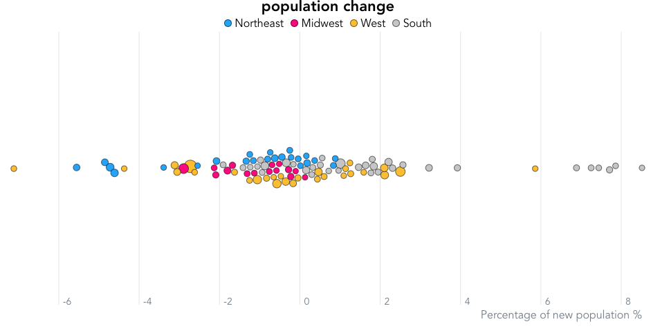

# U.S. Census Bureau Data Analysis



This repository contains data from the U.S. Census Bureau, specifically focusing on the components of change for the years 2020 to 2022. The primary objective of this project is to utilize Svelte.js and D3.js to create a compelling beeswarm visualization that highlights post-pandemic migration trends among people from different parts of the United States.

## Project Overview

The COVID-19 pandemic brought about significant changes in population dynamics, and understanding these shifts is crucial for various fields, including economics, sociology, and urban planning. This project draws inspiration from Connor Rothschild's course on "Better Data Visualizations with Svelte" ([Course Link](https://www.newline.co/courses/better-data-visualizations-with-svelte?utm_source=newline&utm_medium=email&utm_campaign=20230903_lctjt6w&utm_content=l1&inf_contact_key=8539faea268b2e7ea821e67a91254417f651f238aa2edbb9c8b7cff03e0b16a0)) and aims to present the Census Bureau data in an informative and visually engaging manner.

## Goals

1. **Data Exploration**: Begin by exploring the U.S. Census Bureau data for the years 2020 to 2022 to identify trends and patterns related to population changes.

2. **Visualization Development**: Utilize Svelte.js and D3.js to create a beeswarm visualization that effectively communicates the migration trends among people from different parts of the United States. The beeswarm plot is an excellent choice for visualizing individual data points within a crowded dataset.

3. **Insights and Analysis**: Analyze the visualization to extract meaningful insights about post-pandemic population shifts, such as which regions experienced the most significant influx or outflow of people.

4. **Interactive Features**: Implement interactive elements in the visualization to allow users to explore the data further, providing a more engaging experience.

## Getting Started

To get started with this project, follow these steps:

1. Clone this repository to your local machine.
   
   ```bash
   git clone https://github.com/yourusername/us-census-migration-analysis.git
   ```

2. Navigate to the project directory.

   ```bash
   cd us-census-migration-analysis
   ```

3. Install the required dependencies for the project. Ensure you have Node.js and npm installed.

   ```bash
   npm install
   ```

4. Run the project locally for development and testing.

   ```bash
   npm run dev
   ```

5. Access the visualization in your web browser at `http://localhost:5000`.

## Contribution Guidelines

Contributions to this project are welcome. If you have suggestions, enhancements, or bug fixes, please submit them as issues or pull requests in this repository.

## Acknowledgments

- Connor Rothschild for the inspiring course on data visualizations with Svelte.
- U.S. Census Bureau for providing the valuable dataset.

Let's work together to create a compelling data visualization that sheds light on the migration trends in the post-pandemic United States!